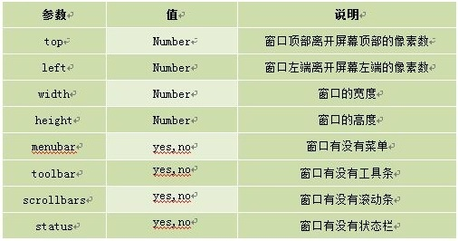
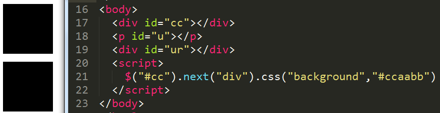
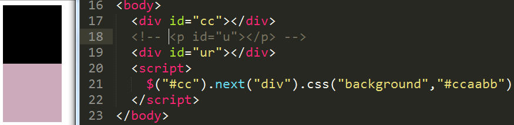

# About-Javascript
####record the thing which maybe forgetten
--------------------------------------

--------------------------------------

- **Javascript DOM**

  1.	document.write + "html/css 标签";
  2.	prompt("这里是对话框显示部分","这里是文本框提示部分") = alert + inputtext + cancel +confirm;
  3.	confirm(str) = alert + confirm + cancel;
  4.	window.open("URL","para1","para2");
    - para1:
	    - _blank：在新窗口显示目标网页
	    - _self：在当前窗口显示目标网页
	    - _top：框架网页中在上部窗口中显示目标网页
    - para2:
    - 	
  5.	e.g.

  	```html
	var a = window.open(…);
	a.close(); // close the window
  	```
  6.	
  ```html
      <h2 id = "cc">My Beautiful girl</h2>
      js: var c = getElementById("cc");
          c.innerHTML = “the text which we like”;
```

- **About JQuery**【学自锋利的jQuery】

  1.**Rules**
  	- $("#foo") is the same as jQuery("#foo")
  	- compare with DOM

  	|compare|DOM|jQuery|
	|:---:|:---:|:---:|
	|-|网页所有内容加载完毕后执行<br />window.onload() = function(){...};|DOM结构绘制完毕后执行<br />$(document).ready(function(){...});<br />or briefly<br />$(function(){...});|
	|-|document.getElementById("cc").innerHTML|$("#cc").html()|
	|-|document.getElementById("cc").checked|$("cc").attr("checked")|
	|获得对象类型|DOM对象|jQuery对象|
	|互相转换|var cr = document.getElementById("cr");<br />var $cr = $(cr)<br />alert($cr.attr("checked"));|var $cr = $("#cr");<br />var cr = $cr[0];<br />or<br />var cr = $cr.get(0);<br />alert(cr.checked);|
	
  2.**Resolve conflicts**
  	
  	*jQuery几乎所有插件都被限制在命名空间内，通常全局对象都被存储在jQuery命名空间内，默认情况下，jQuery用$作为自身快捷键，所以当其他框架需要$控制权时，需要给出如下命令*
  	- 先导入其他框架
  		- 通过"jQuery.noConflict();"让出$的控制权，然后可以通过"jQuery(...)"来操作jQuery对象，此时可以在jQuery内部继续使用$符
  		
  		```html
  		jQuery.noConflict();
  		jQuery(function($){  			//这句的jQuery可以省略，从而定义匿名函数并定义形参为$
  			$("p").click(function(){	//当然也可以不传$为参数，然后内部继续使用jQuery，不使用快捷键操作
  				alert($(this).text());	//好纠结。。觉得怎样都不舒服呢。。所以还是别引入其他的框架好了，嗯【匿-】
  			})
  		})
  		```
  		- 或者 by "var $j = jQuery.noConflict();" 自定义快捷方式来操作jQuery对象&emsp;&emsp;&emsp;&nbsp;//*感觉这个不错吖么么哒*
  	- 先导入jQuery
  		- 直接用jQuery来工作就好了，不用"jQuery.onConflict()"来让出控制权&emsp;&emsp;&emsp;&emsp;&emsp;//*我的理解是后导入的框架覆盖了$的控制权，所以$的控制权本来就在人家身上，不用你让出来，你乖乖的用你自己的名字就好了，嗯【认真脸】*
  	
  3.**About Selector**
	
	总的来说，给我感觉和css选择器规则相差不大，所以大致写一下加强记忆好了。至于优点，就是和之前js的getElementById相比更加简短了，还有就是容错率高了0.0。
	- 基本选择器
		- $("#test")&emsp;&emsp;&emsp;&emsp;//*选择id为test的元素*
		- $(".test")&emsp;&emsp;&emsp;&emsp;&nbsp;//*选择class为test的元素* 
		- $("p")&emsp;&emsp;&emsp;&emsp;&emsp;&nbsp;&nbsp;//*选择所有的p元素*
		- e.g. $(".test").css("background","#0fccefc"); $("#test,div,.cc").css("background","#cca343");
	- 层次选择器
		- $("body p")&emsp;&emsp;&emsp;&emsp;&nbsp;&nbsp;&nbsp;//*选择body中的所有p元素*
		- $("body > p")&emsp;&emsp;&emsp;&emsp;//*选择body中的所有p儿子元素[不包括孙子元素哦]*
		- $("#cc + div")&emsp;&emsp;&emsp;&emsp;//*选择id为cc的元素的下一个div兄弟元素*
			- 要是紧邻着的兄弟哦
			- e.g. [忘记写分号不要太在意- - ][明明只有你自己在意吧喂]
			
			
			
		- $("#cc ~ div")&emsp;&emsp;&emsp;//*选择id为cc的元素后面所有的div兄弟们*
		- by the way,后两种，在jQuery中有更好的写法
			- $(".one + div") == $(".one").next("div")
			- $(".one ~ div") == $(".one").nextAll("div")&emsp;&emsp;&emsp;//*个人感觉后一种写法更加方便记忆*
			- $(".one").sibling("div")&emsp;&emsp;&emsp;&emsp;&emsp;&emsp;&emsp;&emsp;&emsp;&emsp;&emsp;//*选择class为one的元素所有同辈的div元素，前面的也会被选上哦*
	- 过滤选择器
		- 基本过滤选择器[啊啊啊，不想敲了。。明天再敲或者干脆找个图片贴上怎么样0.0，嗯，今天就这样吧]
		- 不好意思。。弃坑了几天，刚刚分手情绪不够稳定，不过现在可以继续学习辣。虽然现在除了我没人看，但是觉得还是要解释一下的好呢。
		- 再有就是觉得选择这里，又看了两遍，觉得这种东西，没必要花费时间整理，大概了解之后用的时候现查就好了[记忆残患者!]
	- 不如说一下在练习的时候注意到的一些小细节
		- 一直以为开始标签和结束标签之间没有东西就可以简写成```<br />```这种，然后在配置jquery时狠狠被自己坑了一下
			```
			<script src = "jquery.min.js"></script>
			```
			要这样写才行。。被自己蠢哭。。
		- 还有就是
		
		```html
		$("p:contains('我')").css("background","#bbccaa");	//选择内容包含“我”的p元素，改变其背景色
		$("p:contains(我)").css("background","#bbccaa");	//发现参数的参数可以写单引号也可以不写，总觉得写上好一点，毕竟XHTML
		$("p:eq(3)").css("background","#bbccaa");		   //选择索引值为3的p元素，这时又不能写引号了，我理解是写了引号就会变成字符型，取的值就是3的ASCII码值了，达不到想要的效果了
		```
	- 
